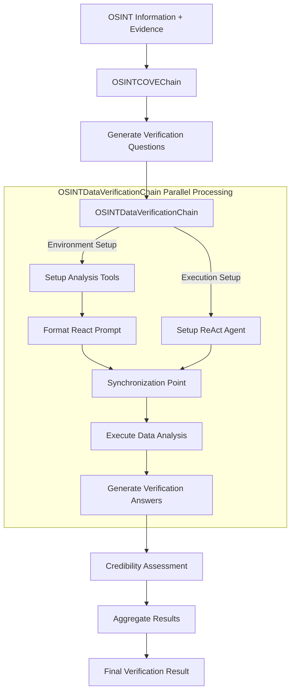

# ⛓ OSINT Chain-of-Verification 🔍

OSINT Verification Tool: Using Chain-of-Verification (CoVe) methodology for assessing the credibility of open-source intelligence, implemented with Python 🐍 + Langchain 🔗 + AI Models 🦾 + Data Analysis Tools 📊

> This project is a fork of the original [Chain-of-Verification](https://github.com/ritun16/chain-of-verification) repository by [Sourajit Saha](https://github.com/ritun16), adapted for OSINT verification use cases.

📄 **Original Article**: [Understanding & Implementation of Chain-of-Verification (CoVe)](https://sourajit16-02-93.medium.com/chain-of-verification-cove-understanding-implementation-e7338c7f4cb5) by Sourajit Saha

## Architecture Overview


## Detailed Verification Process Flow



### Key Components and Their Functions

1. **OSINTCOVEChain**: The main orchestrator
   - Takes OSINT information and collected evidence as input
   - Manages the verification process flow
   - Coordinates between different components

2. **OSINTDataVerificationChain**: Core verification engine
   - **Parallel Processing**:
     - Environment Setup: Prepares analysis tools and configurations
     - Execution Setup: Initializes ReAct agent and required components
   - **Synchronized Execution**:
     - Ensures both setup paths are complete before analysis
     - Executes data analysis with prepared tools and agent
     - Generates comprehensive verification answers

3. **ReAct Agent**: Analysis executor
   - Utilizes prepared environment and tools
   - Performs data analysis based on verification questions
   - Generates detailed analysis results

### Process Review

The verification process follows these steps in parallel and sequence:

1. **Initial Setup** (Parallel):
   - Environment preparation (tools, configurations)
   - ReAct agent initialization
   
2. **Synchronized Execution**:
   - Tool and agent synchronization
   - Data analysis execution
   
3. **Results Processing** (Sequential):
   - Verification answer generation
   - Credibility assessment
   - Final result aggregation

This approach ensures:
- Efficient parallel processing where possible
- Proper synchronization of dependencies
- Comprehensive verification results
- Reliable execution flow

## 🚀 Getting Started
1. **Clone the Repository**
2. **Install Dependencies**: 
    ```bash
    python3 -m pip install -r requirements.txt
    ```
3. **Set Up API Key**: 
    ```bash
    export OPENAI_API_KEY='sk-...'
    ```
4. **Run the Program**: 
    ```bash
    cd src/
    python3 osint_main.py --osint-info "Information to verify" --evidence "Collected evidence" --data-path "data/your_data.xlsx"
    ```

## 🛠 Command Line Arguments
```bash
python3 osint_main.py --osint-info "Information to verify" --evidence "Collected evidence" --data-path "data/yt_tsai_secret.xlsx" --llm-name "o3-mini" --temperature 0.0 --max-tokens 1000 --show-intermediate-steps
```
- `--osint-info`: The intelligence information to verify
- `--evidence`: Collected evidence related to the information
- `--data-path`: Path to the data file for verification
- `--llm-name`: Name of the language model to use
- `--temperature`: Temperature parameter for the model
- `--max-tokens`: Maximum number of output tokens
- `--show-intermediate-steps`: Display intermediate verification steps, such as "verification questions" and "verification answers"

## Core Features

1. **OSINT Information Verification**: Specialized for credibility assessment of open-source intelligence
2. **Data Analysis Verification**: Using ReAct (Reasoning and Acting) methodology to analyze data and verify information accuracy
3. **Chain of Verification Questions**: Automatically generates relevant verification questions to examine information credibility
4. **Credibility Assessment**: Provides a final credibility assessment report

## Technical Implementation

The system uses LangChain and LangGraph to implement Chain-of-Verification and ReAct agents, supporting complex reasoning and analysis tasks. Key components include:

- `OSINTDataVerificationChain`: The core chain that performs data analysis verification
- `OSINTCOVEChain`: Integrates different verification stages into a complete verification process

## Future Improvements

1. **Prompt Engineering**: Optimize prompts in the `prompts/` directory for specific domain requirements
2. **Enhanced Data Analysis**: Expand the analytical capabilities of the ReAct agent, add more data processing tools
3. **Multi-Model Support**: Use different models for different tasks, such as specialized data analysis models
4. **Human-in-the-Loop (HIL)**: Add human feedback mechanisms during verification to improve accuracy
5. **Custom Verification Pipelines**: Customize verification processes and standards for specific use cases

## Acknowledgments

This project builds upon the original Chain-of-Verification implementation by [Sourajit Saha](https://github.com/ritun16). The core concepts and architecture have been adapted for OSINT verification purposes.

❤️ If you find this fork helpful, please star ⭐ and share ✔️!  
Also, please consider supporting the original repository and author if you found their work valuable.
