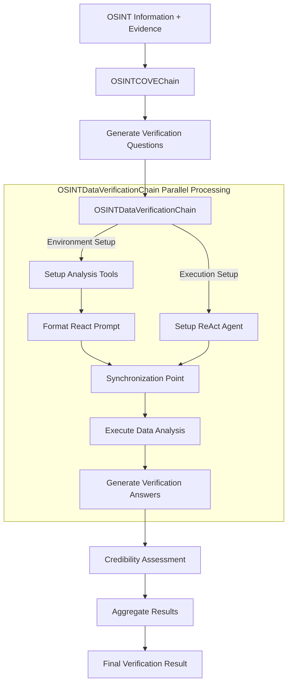

# ⛓ OSINT Chain-of-Verification 🔍

OSINT Verification Tool: Using Chain-of-Verification (CoVe) methodology for assessing the credibility of open-source intelligence, implemented with Python 🐍 + Langchain 🔗 + AI Models 🦾 + Data Analysis Tools 📊

> This project is a fork of the original [Chain-of-Verification](https://github.com/ritun16/chain-of-verification) repository by [Sourajit Saha](https://github.com/ritun16), adapted for OSINT verification use cases.

📄 **Original Article**: [Understanding & Implementation of Chain-of-Verification (CoVe)](https://sourajit16-02-93.medium.com/chain-of-verification-cove-understanding-implementation-e7338c7f4cb5) by Sourajit Saha

## Architecture Overview


## Detailed Verification Process Flow



### Key Components and Their Functions

1. **OSINTCOVEChain**: The main orchestrator
   - Takes OSINT information and collected evidence as input
   - Manages the verification process flow
   - Coordinates between different components

2. **OSINTDataVerificationChain**: Core verification engine
   - **Parallel Processing**:
     - Environment Setup: Prepares analysis tools and configurations
     - Execution Setup: Initializes ReAct agent and required components
   - **Synchronized Execution**:
     - Ensures both setup paths are complete before analysis
     - Executes data analysis with prepared tools and agent
     - Generates comprehensive verification answers

3. **ReAct Agent**: Analysis executor
   - Utilizes prepared environment and tools
   - Performs data analysis based on verification questions
   - Generates detailed analysis results

### Process Review

The verification process follows these steps in parallel and sequence:

1. **Initial Setup** (Parallel):
   - Environment preparation (tools, configurations)
   - ReAct agent initialization
   
2. **Synchronized Execution**:
   - Tool and agent synchronization
   - Data analysis execution
   
3. **Results Processing** (Sequential):
   - Verification answer generation
   - Credibility assessment
   - Final result aggregation

This approach ensures:
- Efficient parallel processing where possible
- Proper synchronization of dependencies
- Comprehensive verification results
- Reliable execution flow

## 🚀 Getting Started
1. **Clone the Repository**
2. **Install Dependencies**: 
    ```bash
    python3 -m pip install -r requirements.txt
    ```
3. **Set Up API Keys**: 
    ```bash
    # Add to .env file in project root
    OPENAI_API_KEY=your-openai-api-key
    ANTHROPIC_API_KEY=your-anthropic-api-key
    GOOGLE_API_KEY=your-google-api-key
    XAI_API_KEY=your-xai-api-key
    
    # Alternatively, set environment variables directly
    export OPENAI_API_KEY=your-openai-api-key
    export ANTHROPIC_API_KEY=your-anthropic-api-key
    ```
4. **Run the Program**: 
    ```bash
    cd src/
    python3 osint_main.py --osint-info "Information to verify" --evidence "Collected evidence" --data-path "data/your_data.xlsx"
    ```

## 🛠 Command Line Arguments
```bash
python3 osint_main.py --osint-info "Information to verify" --evidence "Collected evidence" --data-path "data/yt_tsai_secret.xlsx" --llm-name "o3-mini" --temperature 0.0 --max-tokens 1000 --show-intermediate-steps
```
- `--osint-info`: The intelligence information to verify
- `--evidence`: Collected evidence related to the information
- `--data-path`: Path to the data file for verification
- `--llm-name`: Name of the language model to use
- `--temperature`: Temperature parameter for the model
- `--max-tokens`: Maximum number of output tokens
- `--show-intermediate-steps`: Display intermediate verification steps, such as "verification questions" and "verification answers"

## Multi-Model Support

The system now supports multiple LLM providers for different verification steps:

### Supported Model Providers

- **OpenAI**: GPT-4, GPT-3.5-turbo, GPT-4.1-nano, and o-series models
- **Anthropic**: Claude-3, Claude-3-Opus, Claude-3-Sonnet, Claude-3-Haiku, Claude-3.5-Sonnet, Claude-3.5-Haiku
- **Google**: Gemini-Pro, Gemini-1.5-Pro, Gemini-1.5-Flash
- **XAI (Grok)**: Requires `langchain-xai` package

### Environment Variables

Set API keys for the model providers you wish to use:

```bash
# OpenAI
OPENAI_API_KEY=your-openai-api-key

# Anthropic
ANTHROPIC_API_KEY=your-anthropic-api-key

# Google
GOOGLE_API_KEY=your-google-api-key

# XAI (Grok)
XAI_API_KEY=your-xai-api-key
```

### Customizing Model Configuration

To customize model configuration, modify the `DEFAULTS` dictionary in the `ModelConfig` class in `src/config.py`:

```python
# Default configuration values with multiple model providers
DEFAULTS = {
    "verification_question": {
        "model_name": "gpt-4.1-nano",
        "model_provider": "openai",
        "temperature": 0.0,
        "max_questions": 3,
    },
    "react": {
        "model_name": "claude-3.5-haiku",
        "model_provider": "anthropic",
        "temperature": 0.0,
    },
    "final_assessment": {
        "model_name": "gpt-4.1-nano",
        "model_provider": "openai",
        "temperature": 0.0,
    },
    "aggregation": {
        "model_name": "gemini-1.5-pro",
        "model_provider": "google",
        "temperature": 0.2,
        "top_p": 0.95,
    }
}
```

You can also create custom model configurations programmatically:

```python
from src.config import ModelConfig

# Example: Using different providers for different steps
custom_settings = {
    "verification_question": {
        "model_name": "gpt-4.1-nano",
        "model_provider": "openai",
        "temperature": 0.0,
    },
    "react": {
        "model_name": "claude-3.5-haiku", 
        "model_provider": "anthropic",
        "temperature": 0.0,
    },
    "final_assessment": {
        "model_name": "gemini-1.5-pro",
        "model_provider": "google",
        "temperature": 0.1,
    },
    "aggregation": {
        "model_name": "claude-3-sonnet",
        "model_provider": "anthropic",
        "temperature": 0.0,
    }
}

# Create model configuration
model_config = ModelConfig(model_settings=custom_settings)

# Use with evaluator
evaluator = CoVeEvaluator(
    data_path="processed_data.xlsx",
    evidence_column="found_evidence",
    model_config=model_config,
    print_config=True
)
```

### Provider-Specific Parameters

Each provider supports specific parameters:

- **OpenAI**:
  - `temperature`: Controls randomness (0.0 to 1.0)
  - `reasoning_effort`: For o-series models ("low", "medium", "high")

- **Anthropic**:
  - `temperature`: Controls randomness (0.0 to 1.0)
  - `max_tokens`: Maximum output length

- **Google**:
  - `temperature`: Controls randomness (0.0 to 1.0)
  - `top_p`: Controls token selection (0.0 to 1.0)

- **XAI**:
  - `temperature`: Controls randomness (0.0 to 1.0)

## Excel Data Processing for Batch Verification

The project now includes tools for processing Excel data for batch verification using the CoVe methodology:

### Excel Processor Features

1. **Timestamp-based Iteration Tracking**: 
   - Automatically adds iteration numbering based on timestamp ordering
   - Enables tracking evidence collection over time

2. **Batch Processing with CoVe**:
   - Process multiple evidence records in a single run
   - Uses centralized model configuration from `config.py`
   - Outputs comprehensive verification results

3. **Knowledge Base Integration**:
   - Works with the project's knowledge base format
   - Extracts relevant evaluation results as evidence
   - Processes both `found_evidence` and `evidence_found` fields

4. **Centralized Model Configuration**:
   - All model settings are centralized in the `ModelConfig` class in `config.py`
   - Default settings for all verification steps
   - Each verification step can have different model, temperature, and reasoning effort configurations

### Usage Examples

#### Command Line Usage

```bash
# Basic usage with default settings (all models set to o4-mini with high reasoning effort):
python3 -m src.run_examples --limit 5

# Process all records:
python3 -m src.run_examples --limit all 

# Specify input file, sheet, and output directory:
python3 -m src.run_examples \
  --input-file data/knowledge_base_v2.xlsx \
  --sheet Sheet1 \
  --output-dir results \
  --limit 10

# Set maximum number of verification questions:
python3 -m src.run_examples --limit 3 --max-questions 5

# Set number of concurrent tasks (parallel processing):
python3 -m src.run_examples --limit 10 --concurrent-tasks 3

# Continue from a previous run:
python3 -m src.run_examples --limit 10 --continue-from results/cove_results_YYYYMMDD_HHMMSS.xlsx
```

#### Command Line Arguments for Excel Processing

##### General Arguments
- `--input-file`: Path to input Excel file (default: data/knowledge_base_v2.xlsx)
- `--sheet`: Sheet name to process (default: Sheet1)
- `--output-dir`: Directory for output files (default: results)
- `--limit`: Number of records to process (default: 3, use "all" to process all records)
- `--max-questions`: Maximum number of verification questions to generate (default: 3)
- `--concurrent-tasks`: Maximum number of concurrent tasks to run (default: 5)
- `--continue-from`: Path to existing results file to continue from (for resuming interrupted runs)

### Customizing Model Configuration

To customize model configuration, modify the `DEFAULTS` dictionary in the `ModelConfig` class in `src/config.py`:

```python
# Default configuration values - separated for each model type
DEFAULTS = {
    "verification_question": {
        "model_name": "o4-mini",
        "temperature": 0.0,
        "max_questions": 3,  # 控制每個證據最多生成的驗證問題數量
    },
    "react": {
        "model_name": "o4-mini", 
        "temperature": 0.0,
        "reasoning_effort": "high",  # 使用模型支援的參數，不支援時會顯示錯誤
    },
    "final_assessment": {
        "model_name": "o4-mini",
        "temperature": 0.0,
        "reasoning_effort": "high",  # 使用模型支援的參數，不支援時會顯示錯誤
    },
    "aggregation": {
        "model_name": "o4-mini",
        "temperature": 0.0,
        "reasoning_effort": "high",
    }
}
```

You can also programmatically create a custom configuration:

```python
from src.config import ModelConfig
from src.excel_processing.processor import CoVeEvaluator

# Create custom model settings
custom_settings = {
    "verification_question": {
        "model_name": "gpt-4.1-nano",
        "temperature": 0.7,
        "reasoning_effort": "high",
    },
    "react": {
        "model_name": "o4-mini",
        "temperature": 0.0,
        "reasoning_effort": "medium",
    },
    # ... other settings ...
}

# Create custom model configuration
model_config = ModelConfig(model_settings=custom_settings)

# Create evaluator with custom configuration
evaluator = CoVeEvaluator(
    data_path="processed_data.xlsx",
    evidence_column="found_evidence",
    model_config=model_config,
    print_config=True,  # Optional: Print the configuration
    concurrent_tasks=3  # Control parallel processing
)
```

All model configuration should be done by modifying the `config.py` file or by programmatically creating a custom configuration.

### Output Files

The processor generates these files in the specified output directory:
- `preprocessed_data_[timestamp].xlsx`: Extracted evidence data
- `processed_data_[timestamp].xlsx`: Data with added iteration column
- `cove_results_[timestamp].xlsx`: CoVe verification results

### Recent Improvements

1. **Centralized Model Configuration**: 
   - All model settings are now centralized in the `ModelConfig` class in `config.py`
   - Simplified command-line interface with fewer arguments
   - Consistent default settings for all verification steps

2. **Process All Records Option**:
   - Added "--limit all" option to process the entire dataset
   - Improved record limiting functionality with proper count display

3. **Robust Environment Variable Handling**:
   - Better handling of .env file loading from project root
   - Automatically detects and loads API keys
   - Clear error messages when API keys are missing

4. **Enhanced Error Handling**:
   - Improved handling of various evidence formats (strings, lists, dictionaries)
   - Better handling of NaN values and empty evidence
   - Detailed logging for troubleshooting

5. **Asynchronous Parallel Processing**:
   - Each iteration is processed asynchronously without waiting for previous ones to finish
   - Results are saved immediately as each iteration completes
   - Control concurrency with the `--concurrent-tasks` parameter

6. **Continuous Processing**:
   - Skip already processed iterations to avoid duplication
   - Continue from a previous run with the `--continue-from` parameter
   - Interrupted runs can be resumed without starting over

## Implementation Details and Testing

### Knowledge Base Processing

The Excel processor has been successfully tested with the `knowledge_base_v2.xlsx` dataset:

1. **Data Extraction**: 
   - The processor extracts `collection_result` entries from the knowledge base
   - These results are used as evidence for verification
   - Time-based iteration tracking enables analysis of evidence evolution

2. **Testing the Implementation**:
   ```bash
   # Run the example script with the knowledge base
   python3 -m src.run_examples
   ```

3. **Sample Output**:
   - Preprocessed data: 50 collection results extracted
   - Processing time: ~2-3 minutes for 3 records
   - Results: Detailed verification questions, answers, and credibility assessments 

4. **Knowledge Base Format Compatibility**:
   - The processor is designed to work with the existing project knowledge base format
   - It handles different evidence formats through robust parsing logic
   - Compatible with both the command-line interface and the example script

### Testing Results

For `data/knowledge_base_v2.xlsx`, the processor:
1. Successfully identified and extracted 50 collection results
2. Generated iteration numbers based on timestamp ordering
3. Processed 3 records with o3-mini model using high reasoning
4. Generated detailed verification questions and answers

Output files can be found in the `results/` directory with timestamped filenames for traceability.

## Core Features

1. **OSINT Information Verification**: Specialized for credibility assessment of open-source intelligence
2. **Data Analysis Verification**: Using ReAct (Reasoning and Acting) methodology to analyze data and verify information accuracy
3. **Chain of Verification Questions**: Automatically generates relevant verification questions to examine information credibility
4. **Credibility Assessment**: Provides a final credibility assessment report

## Technical Implementation

The system uses LangChain and LangGraph to implement Chain-of-Verification and ReAct agents, supporting complex reasoning and analysis tasks. Key components include:

- `OSINTDataVerificationChain`: The core chain that performs data analysis verification
- `OSINTCOVEChain`: Integrates different verification stages into a complete verification process

## Project Structure

```
src/
├── analysis/           # Analysis scripts for results
│   ├── analyze_mismatches.py
│   ├── inspect_results.py
│   └── compare_results.py
├── evaluation/         # Evaluation scripts
│   └── async_evaluator.py
├── excel_processing/   # Excel processing for batch verification
│   ├── __init__.py     # Package initialization
│   ├── processor.py    # Core processor and evaluator classes
│   ├── cli.py          # Command-line interface
│   └── examples.py     # Example usage with knowledge base
├── utils/              # Utility scripts
│   ├── check_columns.py
│   ├── check_sheets.py
│   └── check_data.py
├── config.py           # Configuration settings for models
├── osint_main.py       # Main OSINT verification script
├── osint_verification_chain.py  # Core CoVe implementation
├── run_excel_processor.py  # CLI entry point for Excel processing
└── run_examples.py     # Run example knowledge base processing
```

## Why This Structure Is Best Practice

The reorganization of code follows several software engineering best practices:

1. **Package Structure**: Using `__init__.py` creates proper Python packages that can be imported cleanly
   
2. **Modular Design**: Dividing functionality into logical modules improves maintainability and testability
   
3. **Separation of Concerns**:
   - `processor.py` - Core data processing logic
   - `cli.py` - Command-line interface
   - `examples.py` - Example usage and specialized functions
   
4. **Clean Import Paths**: Eliminates the need for `sys.path` manipulation, resulting in more reliable imports
   
5. **Entry Point Scripts**: Simple scripts at the project root that serve as clear entry points for users

6. **Consistent Package Convention**: Follows standard Python package naming and structure conventions

7. **Self-Documentation**: Package and module structure communicates purpose and organization

## Future Improvements

1. **Prompt Engineering**: Optimize prompts in the `prompts/` directory for specific domain requirements
2. **Enhanced Data Analysis**: Expand the analytical capabilities of the ReAct agent, add more data processing tools
3. **Multi-Model Support**: Use different models for different tasks, such as specialized data analysis models
4. **Human-in-the-Loop (HIL)**: Add human feedback mechanisms during verification to improve accuracy
5. **Custom Verification Pipelines**: Customize verification processes and standards for specific use cases

## Acknowledgments

This project builds upon the original Chain-of-Verification implementation by [Sourajit Saha](https://github.com/ritun16). The core concepts and architecture have been adapted for OSINT verification purposes.

❤️ If you find this fork helpful, please star ⭐ and share ✔️!  
Also, please consider supporting the original repository and author if you found their work valuable.

## Installation

1. Clone the repository
2. Install dependencies:
   ```bash
   pip install -r requirements.txt
   ```
3. Set up environment variables in `.env` file:
   ```
   OPENAI_API_KEY=your-openai-api-key
   ANTHROPIC_API_KEY=your-anthropic-api-key
   GOOGLE_API_KEY=your-google-api-key
   XAI_API_KEY=your-xai-api-key
   ```

## Usage

### Async Evaluator

The async evaluator processes LLM evaluation data using specified models and reasoning effort levels.

```bash
python -m src.evaluation.async_evaluator \
    --input "path/to/input.xlsx" \
    --sheet "sheet_name" \
    --output-dir "results" \
    --model "o3-mini" \
    --reasoning-effort "high"
```

#### Parameters

- `--input`: Path to input Excel file (required)
- `--sheet`: Sheet name to evaluate (required)
- `--output-dir`: Directory to save output files (required)
- `--model`: Model to use for evaluation (required, e.g., "o3-mini")
- `--reasoning-effort`: Reasoning effort level (required, choices: "low", "medium", "high")

### Analysis Tools

The analysis tools help in processing and comparing evaluation results:

```bash
# Analyze mismatches
python -m src.analysis.analyze_mismatches

# Inspect results
python -m src.analysis.inspect_results

# Compare results
python -m src.analysis.compare_results
```

### Utility Scripts

Utility scripts for data validation and preparation:

```bash
# Check columns
python -m src.utils.check_columns

# Check sheets
python -m src.utils.check_sheets

# Check data
python -m src.utils.check_data
```

## Output

Evaluation results are saved in the specified output directory with a timestamp:
```
results/evaluation_results_YYYYMMDD_HHMMSS.xlsx
```

## Contributing

1. Fork the repository
2. Create a feature branch
3. Commit your changes
4. Push to the branch
5. Create a Pull Request

## License

This project is licensed under the MIT License - see the LICENSE file for details.
