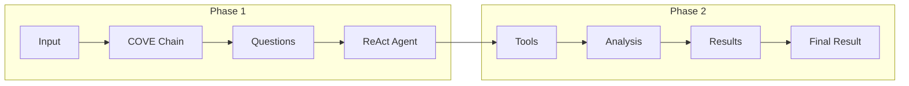

```mermaid
graph LR
    subgraph "Phase 1"
        Input[Input] --> COVE[COVE Chain]
        COVE --> QGen[Questions]
        QGen --> ReAct[ReAct Agent]
    end
    
    subgraph "Phase 2"
        ReAct --> Tools[Tools]
        Tools --> Analysis[Analysis]
        Analysis --> Results[Results]
        Results --> Final[Final Result]
    end
    
    class Input,Final process;
    class COVE chain;
    class ReAct,Tools agent;
``` 